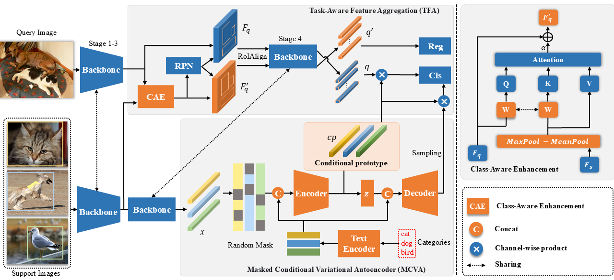

# Conditional Prototype Learning for Few-Shot Object Detection


[🖼️ Poster](poster.pdf)

## Introduction



## Quick Start


~~~bash
# creat a conda environment
conda create -n cpl python=3.8
conda activate cpl
conda install pytorch==1.12.1 torchvision==0.13.1 torchaudio cudatoolkit=11.3 -c pytorch -c conda-forge
# pip install torch==1.12.1 torchvision==0.13.1 torchaudio==0.12.1


# pip install yapf==0.40.1
# pip install setuptools==58.2.0
# python -m pip install pip==20.0.4 

# dependencies
pip install openmim
mim install mmcv-full==1.6.0
mim install mmcls==0.25.0
mim install mmdet==2.24.0
pip install -r requirements.txt

# install mmfewshot
pip install git+https://github.com/open-mmlab/mmfewshot.git
# or manually download the code, then
# cd mmfewshot
# pip install .

# install CPL
python setup.py develop
~~~


## Prepare Datasets
Please refer to [mmfewshot/data](https://github.com/open-mmlab/mmfewshot/blob/main/tools/data/README.md) for the data preparation steps.

## Training
```bash
# single-gpu training
python train.py ${CONFIG}
# eg voc_base
python train.py configs/cpl/voc/split1/cpl_r101_c4_2xb4_voc-split1_base-training.py


# multi-gpus training
bash dist_train.sh ${CONFIG} ${NUM_GPU}
# eg: voc_1_1shot 2gpus
bash dist_train.sh configs/cpl/voc/split1/cpl_r101_c4_2xb4_voc-split1_1shot-fine-tuning.py 2
```
## Test

```bash
# single-gpu test
python test.py ${CONFIG} ${CHECKPOINT} --eval mAP|bbox
# eg voc_base
python test.py configs/cpl/voc/split1/cpl_r101_c4_2xb4_voc-split1_1shot-fine-tuning.py ./work_dirs/cpl_r101_c4_2xb4_voc-split1_1shot-fine-tuning/latest.pth --eval mAP


# multi-gpus test
bash dist_test.sh ${CONFIG} ${CHECKPOINT} ${NUM_GPU} --eval mAP|bbox
# eg: voc_1_1shot 2gpus
bash dist_test.sh configs/cpl/voc/split1/cpl_r101_c4_2xb4_voc-split1_1shot-fine-tuning.py ./work_dirs/cpl_r101_c4_2xb4_voc-split1_1shot-fine-tuning/latest.pth 2 --eval mAP
```

## Acknowledgments

This project is based on  [MMFewShot](https://github.com/open-mmlab/mmfewshot).

Part of the code is adapted from  [VFA](https://github.com/csuhan/VFA) – special thanks to the authors!

## Citation
If you would like to cite this paper, please use the following BibTeX entries:

```BibTeX

```

